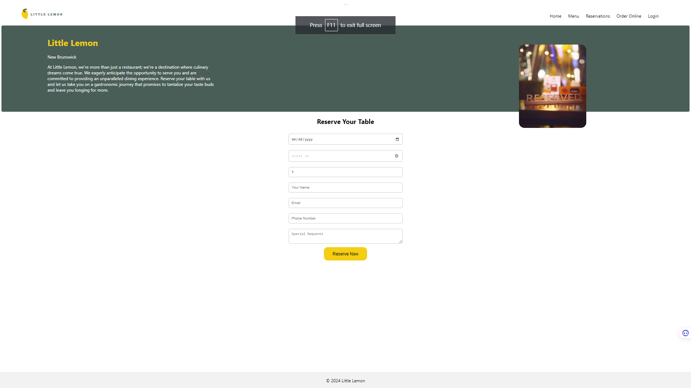

# Little Lemon

## Description
Little Lemon is a restaurant application designed to provide users with an exceptional dining experience through a user-friendly interface. The app allows users to browse the menu, make online reservations, and order food for delivery or pickup.

## Technologies Used
- React.js
- CSS
- HTML
- JavaScript

## App Link
[Little Lemon](https://little-lemon-cafe.netlify.app/)

## Screenshots

## Contributor
- [Kirill Lazutin](https://github.com/Kirill777-web) - Solo Developer

## Credits
- Photos provided by [Unsplash](https://unsplash.com/)

## License
This project is licensed under the [MIT License](LICENSE.md). See the LICENSE file for details.

